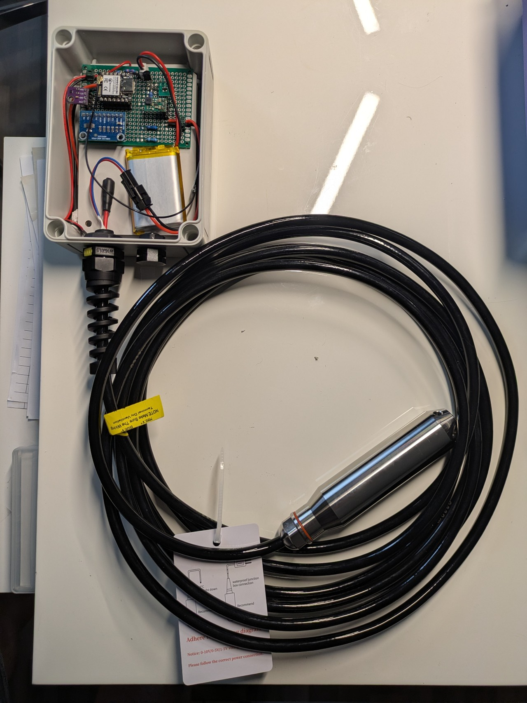
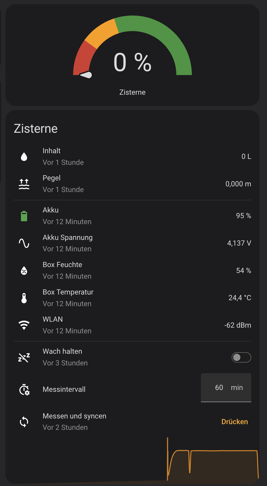

# Zisternen-Füllstand mit XIAO ESP32C6 und ESPHome

Eine Tauchsonde misst den Wasserdruck am Boden der Zisterne. Ein ESP32 rechnet
daraus Höhe und Liter und schickt beides per WLAN an Home Assistant. Das Gerät
läuft auf einem einzelnen LiPo-Akku, misst einmal pro Stunde und schläft
dazwischen.

Der Akku hält über ein Jahr. Einmal im Jahr wird er geladen und das Silica-Gel
gewechselt — sonst ist nichts zu tun.

<a href="bilder/aufbau.jpg"></a>

*Anklicken zeigt das Bild in voller Auflösung.*

---

## Kennzahlen

| | |
|---|---|
| Messprinzip | hydrostatischer Druck, Tauchsonde mit 4–20 mA |
| Genauigkeit | ±4 mm laut Sonde, 4 mm gegen den Zollstock gemessen |
| Messrate | 1× pro Stunde, nachts Pause |
| Wachzeit pro Messung | rund 9 Sekunden |
| Tiefschlafstrom | 15,8 µA |
| Laufzeit | ~18 Monate mit 2000 mAh |
| Wartung | 1× im Jahr: Akku laden, Silica-Gel wechseln |
| Updates | über WLAN, kein Öffnen der Box |
| Materialkosten | siehe [`docs/teileliste.md`](docs/teileliste.md) |

Wann welche Zahl gemessen wurde, steht in
[`docs/messungen.md`](docs/messungen.md).

---

## So funktioniert es

Die Sonde hängt im Wasser und liefert einen **Strom** zwischen 4 und 20 mA —
4 mA heißt leer, 20 mA heißt voll. Strom überträgt sich über lange Kabel ohne
Verlust, anders als eine Spannung.

Dieser Strom fließt durch einen Präzisionswiderstand. Daraus wird eine
Spannung, und die liest ein 16-Bit-Wandler. Der ESP rechnet sie in Meter und
Liter um.

Die Sonde braucht 15 V. Der Akku liefert 3,7 V. Ein Aufwärtswandler erzeugt die
15 V, und ein MOSFET-Schalter trennt ihn zwischen den Messungen komplett ab —
sonst wäre der Akku in Wochen leer.

Ein zweiter Sensor misst Temperatur und Feuchte **innen in der Box**. Er warnt,
bevor Kondenswasser die Platine frisst.

**Schaltplan:** [auf Circuit Canvas ansehen](https://circuitcanvas.com/p/m6995ric96ytq5sfibu)

Dieselbe Schaltung als durchsuchbare Netzliste steht in
[`docs/verdrahtung.md`](docs/verdrahtung.md) — dort mit allen Pin-Nummern und
Bauteilwerten.

---

## Was in Home Assistant ankommt

<a href="bilder/home-assistant.png"></a>

Zwei Bedienelemente reichen: der Schalter **Wach halten** sagt, was gelten
soll, der Knopf **Messen und syncen** wendet es sofort an. Wie das
zusammenspielt, steht in [`docs/betrieb.md`](docs/betrieb.md).

---

## Die vier Entscheidungen

Vier Dinge machen dieses Projekt anders als die meisten Bastellösungen. Jede
hat einen Grund:

- **Tauchsonde mit 4–20 mA statt Ultraschall.** Kein Schaum, keine
  Reflexionen, kein Schwitzwasser auf dem Wandler.
- **Aufwärtswandler mit fester Spannung statt eines einstellbaren Moduls.**
  Nichts, was driften oder verstellt werden kann.
- **Ein Sternpunkt für die Messmasse.** Übergangswiderstände sind hier der
  größte Fehler, nicht der Wandler.
- **Der Wachhalte-Zustand liegt in Home Assistant, nicht auf dem Gerät.** Das
  Gerät ist nur neun Sekunden pro Stunde erreichbar — auf ihm etwas umzulegen
  hieße, dieses Fenster zu treffen.

Ausführlich in [`docs/faq.md`](docs/faq.md).

---

## Nachbau: der Weg durch die Doku

| Schritt | Was du tust | Wo es steht |
|---|---|---|
| 0 | WLAN im Schacht messen, **bevor** du bestellst | [`docs/pruefplan.md`](docs/pruefplan.md), Test 1 |
| 1 | Sicherheitshinweise lesen | [`SICHERHEIT.md`](SICHERHEIT.md) |
| 2 | Teile bestellen | [`docs/teileliste.md`](docs/teileliste.md) |
| 3 | Schaltung verstehen | [`docs/verdrahtung.md`](docs/verdrahtung.md) |
| 4 | Löten, Schritt für Schritt | [`docs/bauanleitung.html`](docs/bauanleitung.html) |
| 5 | Erster Flash, Home Assistant, Kalibrieren | [`docs/inbetriebnahme.md`](docs/inbetriebnahme.md) |
| 6 | Tests abarbeiten | [`docs/pruefplan.md`](docs/pruefplan.md) |
| 7 | Box in den Schacht | [`docs/einbau.md`](docs/einbau.md) |
| 8 | Laufender Betrieb | [`docs/betrieb.md`](docs/betrieb.md) |

**Geht etwas schief:** [`docs/fehlersuche.md`](docs/fehlersuche.md).
**Willst du wissen, warum etwas so ist:** [`docs/faq.md`](docs/faq.md).

---

## Schnellstart

Du brauchst **ESPHome ab Version 2026.8.0**. Ältere Versionen nehmen jedes
Update über WLAN wieder zurück.

```bash
cp secrets.yaml.example secrets.yaml   # WLAN und API-Schlüssel eintragen
esphome run zisterne.yaml
```

Vorher die drei Werte oben in `zisterne.yaml` anpassen: Grundfläche der
Zisterne, maximale Wasserhöhe, Aufhängehöhe der Sonde. Was sie bedeuten, steht
in [`docs/inbetriebnahme.md`](docs/inbetriebnahme.md).

---

## Stand des Projekts

Das Gerät läuft und misst. Elektronik, Firmware und Update über WLAN sind
fertig und geprüft. Was noch fehlt, ist der Einbau in den Schacht und damit die
letzten Tests — WLAN am endgültigen Platz, Dichtheit über Nacht und das
Update-Protokoll dreimal am Stück.

Welcher Test welchen Stand hat: [`docs/pruefplan.md`](docs/pruefplan.md).
Gemessene Zahlen mit Datum: [`docs/messungen.md`](docs/messungen.md).

---

## Alle Dateien im Überblick

| Datei | Inhalt |
|---|---|
| `zisterne.yaml` | die Firmware |
| `secrets.yaml.example` | Vorlage für WLAN und API-Schlüssel |
| `werkzeuge/wlan-test.yaml` | misst WLAN im Schacht vor dem Einkauf |
| `werkzeuge/schlaftest.yaml` | misst den Tiefschlafstrom |
| `docs/teileliste.md` | was du kaufst |
| `docs/verdrahtung.md` | was wohin gehört |
| `docs/bauanleitung.html` | wie gelötet wird |
| `docs/einbau.md` | wohin die Box kommt |
| `docs/inbetriebnahme.md` | einmalige Einrichtung |
| `docs/betrieb.md` | laufender Betrieb |
| `docs/pruefplan.md` | Tests und ihr Stand |
| `docs/messungen.md` | Messwerte mit Datum und Methode |
| `docs/fehlersuche.md` | Symptom, Ursache, Abhilfe |
| `docs/faq.md` | warum es so gebaut ist |
| `SICHERHEIT.md` | Schacht, LiPo, Wasser, Haftung |

---

## Sicherheit

**Lies [`SICHERHEIT.md`](SICHERHEIT.md), bevor du anfängst.** Drei Punkte
kurz:

- **Der Schacht ist gefährlicher als die Elektronik.** Nie allein
  hineinsteigen, Deckel sichern.
- **Ein LiPo ohne Schutzplatine gehört nicht in dieses Projekt.**
- **Nie Labornetzteil und USB gleichzeitig am Board.** Das Netzteil kann keinen
  Strom aufnehmen, seine Spannung läuft hoch.

Nachbau auf eigene Gefahr. Keine Gewährleistung.

---

## Lizenz

MIT — siehe [`LICENSE`](LICENSE).
